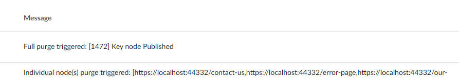
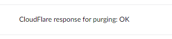

<h3 style="font-size:2.7rem;color:#ff">CogFlare</h3>

[](https://www.nuget.org/packages/Cogworks.CogFlare/)

A package that helps automatically purge CloudFlare cache

<h2 style="color:plum">Usage</h2>

<h3 style="color:salmon">Basic Functionality</h3>

*   When any content node is changed(**Published/Unpublished/Deleted**), that node and any nodes referencing it will be purged from CloudFlare's cache
*   When any media item is changed(**Saved**), it will be purged from CloudFlare's cache
*   The ability to toggle the package functionality on/off in the settings

<h3 style="color:salmon">Advanced Functionality</h3>

*   A list of Ids for **Key Nodes** on the site can be configured in the Settings
*   A **Key Node** is any content node that will require a **FULL site cache purge** to be trigger if that node or any content nodes referenced by it is change (Site Settings, Navigation, Footers...) 

<h3 style="color:salmon">Backoffice Dashboard</h3>

*   A dashboard has been added to the Settings section of the backoffice
*   Currenlty only **Admins** can access it 
*   This dashboard contains a button to manually trigger a **FULL site cache purge**
*   There is also an option to view the current configuration for the package

<h2 style="color:plum">Logs</h2>

There is logged message every time a node eligible for caching is changed and also to show the result of the purge request to CloudFlare



There's also a logged message to show the result of the purge request to CloudFlare



<h2 style="color:plum">Installation</h2>

Install through dotnet CLI:
```c#
dotnet add package Cogworks.CogFlare
```

Or the NuGet Package Manager:
```c#
Install-Package Cogworks.CogFlare
```

Add these settings to the **appsettings.json**
```js
  "CogFlareSettings": {
    "ApiKey": "xxx",
    "Email": "xxx@xxx.com",
    "Endpoint": "https://api.cloudflare.com/client/v4/zones/[zoneId]/purge_cache",
    "KeyNodes": "1234, 031089",
    "IsEnabled": true
  }
```

<h2 style="color:plum">License</h2>

Licensed under the [MIT License](LICENSE.md)

&copy; 2024 [Cogworks](https://www.wearecogworks.com/)