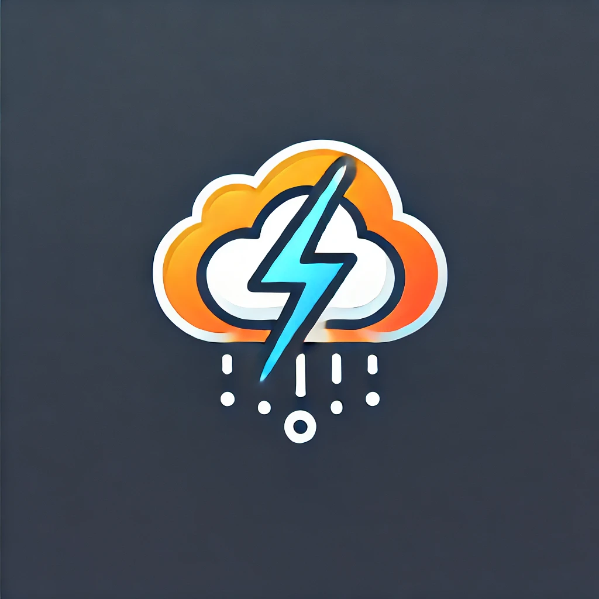

<h3 style="font-size:2.7rem;color:#ff">CogFlare</h3>

[](https://www.nuget.org/packages/Cogworks.CogFlare/)

A package that helps automatically purge CloudFlare cache

<h2 style="color:plum">Usage</h2>

<h3 style="color:salmon">Basic Functionality</h3>

*   When any content node is changed(**Published/Unpublished/Deleted**), that node and any nodes referencing it will be purged from CloudFlare's cache
*   When any media item is changed(**Saved**), it will be purged from CloudFlare's cache
*   The ability to toggle the package functionality on/off in the settings
*   The ability to toggle the Cloudflare cache by adding the property "disableCloudFlareCache" to the node you wish to ignore
*   If you want to bypass a page now you have 2 options, using the "disableCloudFlareCache" in the node or using the "BlockAliases" in the settings

<h3 style="color:salmon">Advanced Functionality</h3>

*   A list of Ids for **Key Nodes** on the site can be configured in the Settings
*   A **Key Node** is any content node that will require a **FULL site cache purge** to be trigger if that node or any content nodes referenced by it is change (Site Settings, Navigation, Footers...) 

<h3 style="color:salmon">Backoffice Dashboard</h3>

*   A dashboard has been added to the Settings section of the backoffice
*   Currenlty only **Admins** can access it 
*   This dashboard contains a button to manually trigger a **FULL site cache purge**
*   There is also an option to view the current configuration for the package

<h2 style="color:plum">Logs</h2>

There is logged message every time a node eligible for caching is changed and also to show the result of the purge request to CloudFlare


There's also a logged message to show the result of the purge request to CloudFlare


<h2 style="color:plum">Installation</h2>

Install through dotnet CLI:
```c#
dotnet add package Cogworks.CogFlare
```

Or the NuGet Package Manager:
```c#
Install-Package Cogworks.CogFlare
```

Add these settings to the **appsettings.json**
```js
  "CogFlareSettings": {
    "IsEnabled": true,
    "ApiKey": "xxx",
    "Email": "xxx@xxx.com",
    "Endpoint": "https://api.cloudflare.com/client/v4/zones/[zoneId]/purge_cache",
    "Domain": "https://www.example.com",
    "KeyNodes": "1234, 031089", // optional
    "BlockAliases": "formBlock, otherFormBlock", // optional
    "CacheTime": "2592000" // optional => will default to 1 month
  }
```

To add cache headers to your pages please add the view component in your Master or required page View
```razor
@await Component.InvokeAsync("CacheHeaders")
```

By default the cache time will be set to 1 month. This can be overriden in the CogFlare Settings

<h2 style="color:plum">Umbraco Forms and Anti-Forgery Tokens with Full Page HTML Caching</h2>

Umbraco Forms include **anti-forgery tokens** by default. These tokens must be unique for each page to ensure forms function correctly. 

However, when implementing **full-page HTML caching**, this can cause issues: cached pages will reuse the same anti-forgery token, breaking the forms on those pages.

This package provides a solution to ensure both caching and forms can coexist seamlessly.

<h3 style="color:salmon">Problem with Caching and Forms</h3>

If you use **full-page HTML caching** for a page containing an Umbraco form:
- The **anti-forgery token** will be cached along with the page's HTML.
- When users access the page, the token will no longer be unique, causing form submissions to fail.

<h3 style="color:salmon">Workarounds</h3>

To resolve this issue, the package offers two options:

### **Option 1: Disable Anti-Forgery Tokens**
You can **disable anti-forgery tokens** for the affected pages:
1. This allows the page to remain cached while keeping the form functional.
2. **Caution**: Disabling anti-forgery tokens may reduce the security of form submissions.

### **Option 2: Use Blocklist Aliases to Disable Caching for Specific Pages**
This package includes a feature to **conditionally disable caching** for pages containing specific blocks, such as forms, to avoid the anti-forgery token issue.

1. **How It Works**:
   - In the `CogFlareSettings` in the appsettings, you can provide a **blocklist alias** (e.g., a block alias for the Umbraco form or any other block you don’t want to cache).
   - When rendering the page, the package checks for the presence of any of the specified block aliases.
   - If the page includes a block with one of these aliases, `private, no-cache, must-revalidate` will be set for the page, effectively disabling caching for that page.

2. **Configuration**:
   Add your `BlockAliases` to the `CogFlareSettings`:
```js
  "CogFlareSettings": {
    ...
    ...
    "BlockAliases": "formBlock, otherFormBlock"
  }
```


## Backoffice User:

```sh
Email: admin@admin.com
Password: 0123456789
```

<h2 style="color:plum">License</h2>

Licensed under the [MIT License](LICENSE.md)

&copy; 2024 [Cogworks](https://www.wearecogworks.com/)