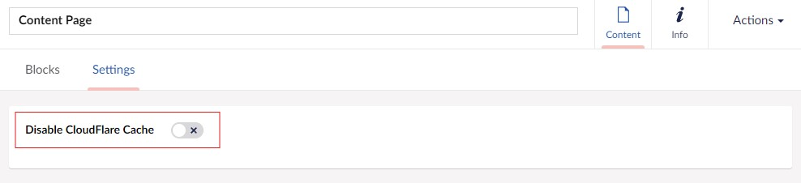

# CogFlare

[](https://www.nuget.org/packages/Cogworks.CogFlare/)

A package that helps automatically purge CloudFlare cache

## Usage

### Basic Functionality

*   When any content node is changed(**Published/Unpublished/Deleted**), that node and any nodes referencing it will be purged from CloudFlare's cache
*   When any media item is changed(**Saved**), it will be purged from CloudFlare's cache
*   The ability to toggle the package functionality on/off in the settings
*   The ability to toggle the cloudfare cache by adding the property "disableCloudFlareCache" to the node you wish to ignore
*   If you want to bypass a page now you have 2 options, using the "disableCloudFlareCache" in the node or using the "BlockAliases" in the settings

### Advanced Functionality

*   A list of Ids for **Key Nodes** on the site can be configured in the Settings
*   A **Key Node** is any content node that will require a **FULL site cache purge** to be trigger if that node or any content nodes referenced by it is change (Site Settings, Navigation, Footers...) 

### Backoffice Dashboard

*   A dashboard has been added to the Settings section of the backoffice
*   Currenlty only **Admins** can access it 
*   This dashboard contains a button to manually trigger a **FULL site cache purge**
*   There is also an option to view the current configuration for the package

# Logs

There is logged message every time a node eligible for caching is changed and also to show the result of the purge request to CloudFlare

There's also a logged message to show the result of the purge request to CloudFlare

# Installation

Install through dotnet CLI:
```c#
dotnet add package Cogworks.CogFlare
```

Or the NuGet Package Manager:
```c#
Install-Package Cogworks.CogFlare
```

Add these settings to the **appsettings.json**
```js
  "CogFlareSettings": {
    "ApiKey": "xxx",
    "Email": "xxx@xxx.com",
    "Endpoint": "https://api.cloudflare.com/client/v4/zones/[zoneId]/purge_cache",
    "KeyNodes": "1234, 031089",
    "IsEnabled": true,
    "BlockAliases": "formBlock,newBlock",
    "Domain": "https://www.example.com"
  }
```

For bypass logic you can use 2 options :
1. Adding a new property "disableCloudFlareCache" in the node where you want to disable cache :

2. Adding the block aliases which will be included in the view where you want to disable cache :
    ```js
      "CogFlareSettings": {
        ...
        "BlockAliases": "formBlock,newBlock, ...",
        ...
      }
    ```
    And then you need to add the view component in your Master or required page View
    ```razor
      @using Cogworks.CogFlare.Core.Constants
      @{	
            @await Component.InvokeAsync(ApplicationConstants.CogFlareCacheHeaders)
        }
    ```

## Backoffice User:

```sh
Email: admin@admin.com
Password: 0123456789
```

### License

Licensed under the [MIT License](LICENSE.md)

&copy; 2024 [Cogworks](https://www.wearecogworks.com/)